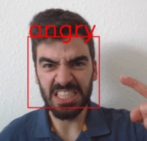

# Emotion Recognition Web Application with Keras, OpenCV, and Flask

<p align="center">
  
</p>

**Table of Contents**:

<!--ts-->
- [Overview](#overview)
- [Facial Emotion Recognition](#facial-emotion-recognition)
- [Business Objective](#business-objective)
- [Project Summary](#project-summary)
  - [1. Building and Training a CNN](#1-building-and-training-a-cnn)
  - [2. Face Detection](#2-face-detection)
  - [3. Hosting the App](#3-hosting-the-app)
- [Data](#data)
- [Running the App](#running-the-app)
- [References](#references)
- [Feedback](#feedback)
<!--te-->

<br>

## Overview

In this project, we will create a web app that detects human faces in a frame (image or video) and classifies them based on emotion. The project consists of three main sections:

- Building and training a Convolutional Neural Network (CNN) with Keras
- Implementing face detection using OpenCV
- Hosting the app in a browser using Flask

You can view a demonstration of the web app: [](https://www.youtube.com/watch?v=SIfTLlqHSbc&feature=youtu.be)

<br>

**→ Skills**: *Image Classification with Convolutional Neural Networks, Computer Vision (Face Detection), Model Deployment, Data Visualisation, Data Augmentation* <br>
**→ Technologies**: *Python, Jupyter Notebook, Google Colab* <br>
**→ Libraries**: *Keras, Tensorflow, Flask, OpenCV (cv2), Scikit-learn, Numpy, Matplotlib, Seaborn* <br>

<br>

## Facial Emotion Recognition

Facial Emotion Recognition (FER), or simply Emotion Recognition, is the process of detecting displayed human emotions using artificial intelligence based technologies to evaluate non-verbal responses to products, services or goods.

FER enables computer systems to adapt their responses and behavioural patterns according to the emotions of humans, thus making the interaction more natural. For instance, one application can be found in an automatic tutoring system, where the system adjusts the level of the tutorial depending on the user's affective state, such as excitement or boredom.

Additionally, businesses can use FER to gain additional feedback on products and services. Using facial emotion recognition can aid in understanding which emotions a user is experiencing in real-time. This is an excellent addition to verbal feedback as it provides a more complex review of the user experience.

Consequently, FER has been an active field of computer vision and has use cases across various industries, such as healthcare, marketing, manufacturing, etc.
For more information, please refer to articles published in [ScienceDirect](https://www.sciencedirect.com/science/article/pii/B9780128146019000286), [Iflexion](https://www.iflexion.com/blog/emotion-recognition-software), [IT Business Edge](https://www.itbusinessedge.com/business-intelligence/value-emotion-recognition-technology/), and [Sightcorp](https://sightcorp.com/knowledge-base/emotion-recognition/).

<br>

## Business Objective

Imagine that we are hired as data scientists by an advertising company, specialising in electronic boards at football matches. The company wants to develop software that detects fans’ faces, estimates their emotion, and adjusts ads based on collective emotion.

Our task is to develop a Deep Learning model that implements emotion recognition and integrate it with a face detection algorithm. The final product shall be delivered as a web application that accepts live video as input. The company will then integrate our product with their systems for automatic ad renewal according to the change of emotions during football games.


<br>

## Project Summary

###	1. Building and Training a CNN

This section is performed entirely in the [Jupyter notebook](https://github.com/KOrfanakis/Emotion_Recognition_Deep_Learning_App/blob/main/Emotion_Recognition_Notebook.ipynb) run on Google Colab. It contains the usual steps in training a CNN model: loading the data, performing data augmentation, creating, compiling, and training the model, and using the trained model to make predictions. The dataset used to train the CNN is the **`FER2013`** dataset (more details are provided in the [*Data*](#data) section). A schematic illustration of the model’s architecture is shown below, while a more detailed summary (as produced by Keras's `summary()` method) is included in the [*images*](https://github.com/KOrfanakis/Emotion_Recognition_Deep_Learning_App/blob/main/images/CNN_Architecture_Summary.png) folder.

<br>

<p align="center">
  
</p>

<br>

The model achieves **approximately 69.5% (validation) accuracy** across all labels/emotions, beating the **baseline human-level accuracy of ~65%**. For a more detailed breakdown of the model's performance, please refer to the [*Assessing Performance*](https://nbviewer.org/github/KOrfanakis/Emotion_Recognition_Deep_Learning_App/blob/main/Emotion_Recognition_Notebook.ipynb#Assessing-Performance) section of the Jupyter notebook. 

<br>

###	2. Face Detection

This part of the project will be implemented using [Haar Cascades](https://docs.opencv.org/3.4/db/d28/tutorial_cascade_classifier.html) and [OpenCV](https://opencv.org/). A Haar classifier, or a Haar cascade classifier, is an object detection program that identifies objects in an image or video. The OpenCV library maintains a repository of pre-trained Haar cascades. We only need the `haarcascade_frontalface_default.xml` file for this project, which detects the front of human faces.

<br>

### 3. Hosting the App

Lastly, we will use Python’s [Flask](https://flask.palletsprojects.com/en/2.1.x/) web framework to host our application in a browser. For this purpose, the [`app.py`](https://github.com/KOrfanakis/Emotion_Recognition_Deep_Learning_App/blob/main/app.py) file loads the CNN model and the Haar cascade classifier, detects a face and uses the model to predict its emotion. The HTML document used to create the web app is included in the [*templates*](https://github.com/KOrfanakis/Emotion_Recognition_Deep_Learning_App/tree/main/templates) folder.

Instructions on how to run the web app are provided in the [*Running the App*](#running-the-app) section.

<br>

## Data

For training and testing the model, we will use the **[`FER2013`](https://www.kaggle.com/c/challenges-in-representation-learning-facial-expression-recognition-challenge/data)** dataset, a well-studied dataset that has been the subject of many Deep Learning competitions and research papers. The dataset consists of 35,887 images of human faces normalised to 48x48 pixels in grayscale and organised into different folders based on the emotion they depict. There are seven different emotions: *angry*, *disgust*, *fear*, *happy*, *neutral*, *sad*, and *surprise*. Unfortunately, there is a significant imbalance in the dataset, with the *happy* class being the most prevalent and the *disgust* class being noticeably underrepresented.

The dataset is extracted from Kaggle through [this link](jonathanoheix/face-expression-recognition-dataset). Instructions on how to download it and open it with Colab are provided in the [*Getting the Data*](https://nbviewer.org/github/KOrfanakis/Emotion_Recognition_Deep_Learning_App/blob/main/Emotion_Recognition_Notebook.ipynb#Getting-the-Data) section of the Jupyter notebook.

<br>

<p align="center">
  
</p>

<br>

## Running the App

The most straightforward way to launch the Flask app is to run it locally. Flask needs to be told where to find our application in order to use it. This is achieved by setting the `FLASK_APP` environment variable. For this purpose, open a (Windows) command prompt, navigate to the project’s directory and run the following command:

```
set FLASK_APP=app
```
Followed by:
```
flask run
```

Finally, open up a web browser and enter the following URL in the address field:
```
http://localhost:5000/
```

A more detailed explanation of how to run a Flask app is provided in Flask’s [Quickstart guide](https://flask.palletsprojects.com/en/2.1.x/quickstart/).

Moreover, our Flask app can be deployed online to the [Heroku platform]( https://realpython.com/flask-by-example-part-1-project-setup/), which is something that I will try doing in a future version of this project. 

<br>

## References

The main resources for creating this project are:

**Deep Learning**

&emsp;[1] Aurélien Géron. [*Hands-On Machine Learning with Scikit-Learn, Keras, and TensorFlow: Concepts, Tools, and Techniques to Build Intelligent Systems*](https://www.oreilly.com/library/view/hands-on-machine-learning/9781492032632/). 2nd ed., O’Reilly Media, 2019.

&emsp;[2] Francois Chollet. [*Deep Learning with Python*](https://www.manning.com/books/deep-learning-with-python). 2nd ed., Manning, 2021.

For a full list of references, please refer to the [*References*](https://nbviewer.org/github/KOrfanakis/Emotion_Recognition_Deep_Learning_App/blob/main/Emotion_Recognition_Notebook.ipynb#References) section of the Jupyter notebook.

<br>

**Face Detection**

&emsp;[3] Adrian Rosebrock. [*OpenCV Face detection with Haar cascades*](https://pyimagesearch.com/2021/04/05/opencv-face-detection-with-haar-cascades/).
pyimagesearch.com, 5 Apr. 2021

<br>

**Flask App**

&emsp;[4] Anmol Behl. [*Video Streaming Using Flask and OpenCV*](https://medium.datadriveninvestor.com/video-streaming-using-flask-and-opencv-c464bf8473d6). TowardsDataScience, 11 Feb. 2020

&emsp;[5] Karan Sethi. [*Emotion Detection Using OpenCV and Keras*](https://medium.com/swlh/emotion-detection-using-opencv-and-keras-771260bbd7f7). Medium, 23 Jun. 2020

<br>

## Feedback

If you have any feedback or ideas to improve this project, feel free to contact me via:

<a href="https://twitter.com/korfanakis">
  
</a>

<a href="https://uk.linkedin.com/in/korfanakis">
  
</a>
